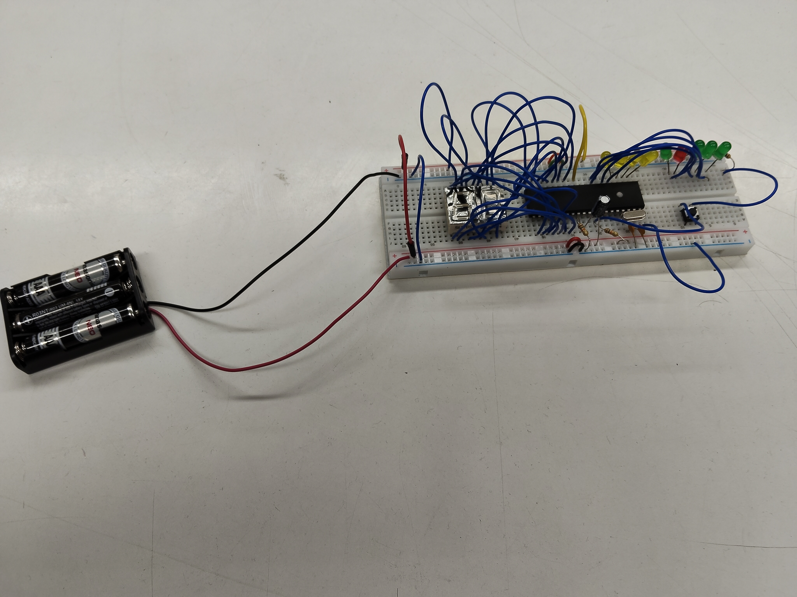
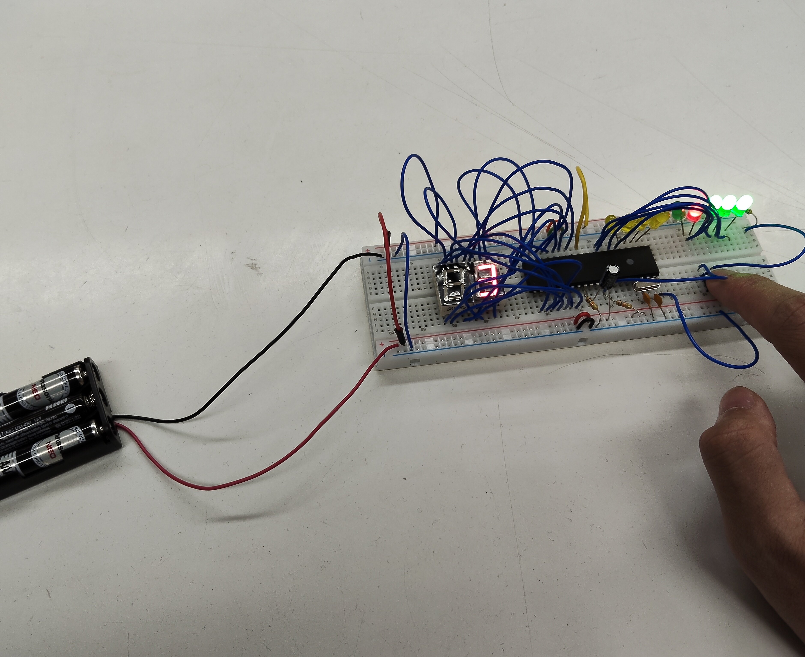
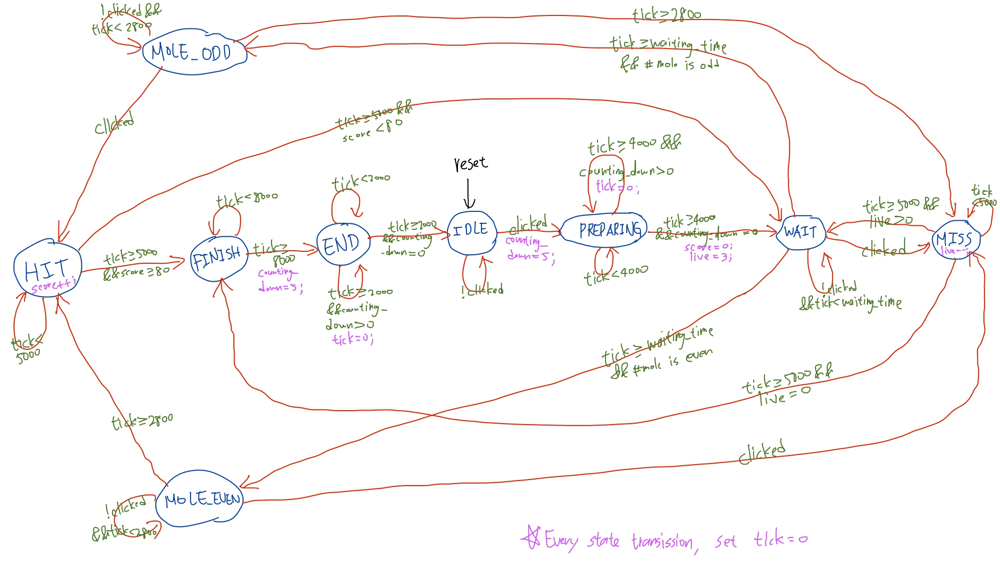

# Whac-A-Mole 8051 Game 

## Project Overview
This project implements a **Whac-A-Mole** style game using the **AT89S51/AT89S52** microcontroller.  
The game uses **Timer0 in Mode 2** to generate a fast system tick and **external interrupts** to detect button presses.

## Demo / Hardware Setup

  

    
  

  

    
  

## Features

- 4 moles randomly appear in a pattern on LEDs connected to **P2.0~P2.3**.
- Single push-button input connected to **P3.2 (INT0)**.
- Two 7-segment displays show countdown and current score (**P0** and **P1**).
- Hit / Miss indication using status LEDs (**P2.4, P2.5**).
- Player lives tracking using LEDs (**P2.6, P2.7**).
- Game finite state machine (FSM) handles:
  - Idle / Preparing countdown
  - Mole appearing (even/odd pattern)
  - Hit / Miss detection
  - Game finish sequence
- Timer0 interrupt triggers approximately **4000 times per second** for game timing.

## Hardware Connections

- **mole LEDs**: P2.0-P2.3
- **7-segment display**: P0, P1
- **Button (INT0)**: P3.2  
  - Connect button with pull-up resistor to VCC, press to GND
- **Status LEDs** (Hit/Miss): P2.4, P2.5
- **life value LEDS**: P2.6, P2.7

## Software Details

- **Language:** C
- **MCU:** AT89S51
- **Timer:** Mode 2, 8-bit auto-reload
- **Interrupts:**
  - Timer0: game tick
  - INT0: button press
- **FSM State Machine:**

  

    
  

## Usage

1. Flash the `.hex` file to AT89S51/AT89S52.
2. Connect LEDs, 7-segment, and button as described.
3. Press the button to start the game.
4. Hit the moles when odd number of moles appear and do not hit when even number of moles appear.

## Game Rules

- The player interacts using a single button (INT0).

- When moles appear:
  - If the number of moles is **odd**, the player **should press** the button.
  - If the number of moles is **even**, the player **should NOT press** the button.

- **Hit condition:**
  - Pressing the button when the mole count is odd
  - Not pressing when the mole count is even

- **Miss condition:**
  - Pressing when the mole count is even
  - Not pressing when the mole count is odd
  - Pressing before any mole appears

- The player starts with **3 lives**.
  - Each **Hit** → score +1
  - Each **Miss** → lose 1 life

- The game ends when:
  - The score reaches **80**, or
  - All lives are lost

## Files

- `main.C` — Main game logic and FSM  
- `REG51.H` — 8051 register definitions  
- `main.hex` — Compiled firmware for MCU